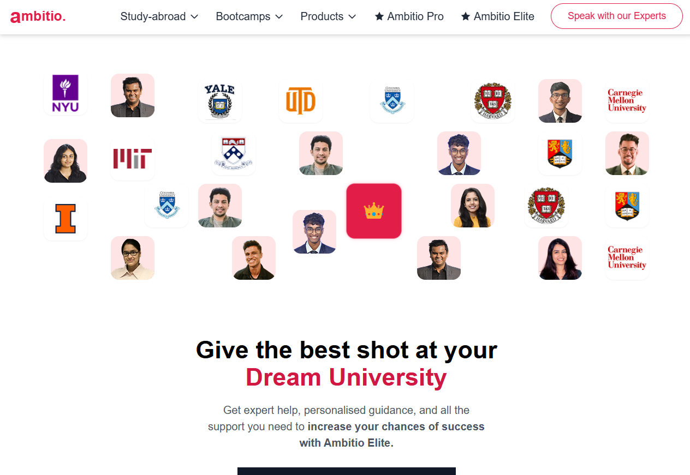

# University Admissions Visualizer



An interactive visualization showcasing top universities and student success stories with engaging animations and responsive design.

## Features

- 🎓 **University Showcase**: 17 top university logos with strategic positioning
- 👥 **Student Network**: 13 student avatars forming connections
- 👑 **Interactive Crown**: Animated centerpiece with hover effects
- 🖱️ **Parallax Motion**: Elements respond to cursor movement
- 🔄 **Auto-Rotating Focus**: Automatic spotlight cycling
- ✨ **Animated UI**: Smooth transitions and hover states
- 📱 **Fully Responsive**: Works on all device sizes

## Technologies Used

- ⚛️ React 18
- 🎨 Tailwind CSS
- 🏗️ Framer Motion (for animations)
- 🖼️ Dynamic Image Loading
- 🚀 Vite (Build Tool)

## Installation

1. Clone the repository:
   ```bash
   git clone https://github.com/yourusername/university-visualizer.git
   cd university-visualizer
